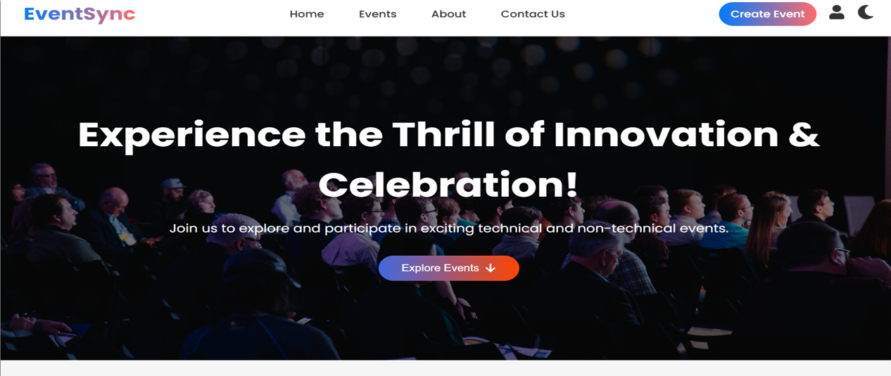
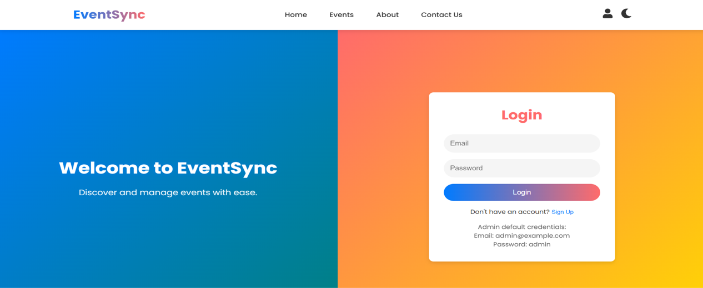
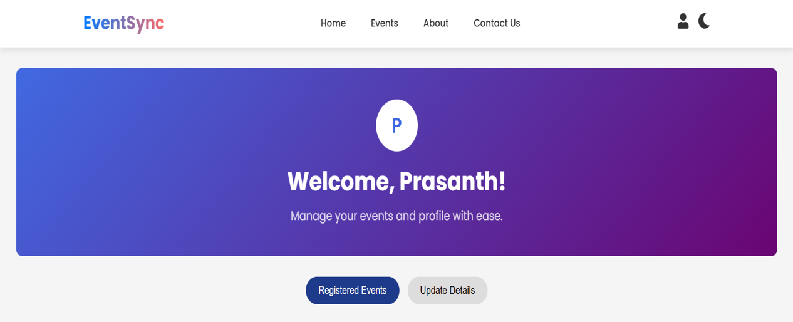
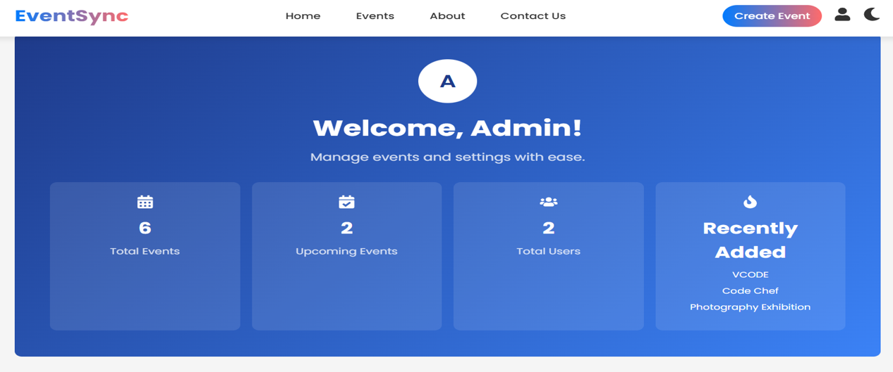

# 🎉 Event Management System

The Event Management System (EMS) is a full-stack web application developed using the MERN stack (MongoDB, Express.js, React.js, Node.js). It is designed to streamline the entire event lifecycle — from event creation and promotion to participant registration, communication, and post-event analysis.

🔹 Motivation

Traditional event management in institutions often involves manual registration, paper-based approvals, and poor communication between organizers and participants. This leads to missed opportunities, delays, and confusion. Our system addresses these inefficiencies by providing a centralized digital platform for managing events.

🔹 Key Objectives

Provide a user-friendly portal where participants can discover, filter, and register for events.

Offer organizers and admins powerful dashboards to manage event details, registrations, and announcements.

Enable real-time notifications (email/SMS/in-app) for important updates.

Support data-driven insights through analytics and reporting.

Ensure secure, scalable, and responsive architecture for institutional and large-scale use.
---

## 🚀 Features

### 👤 For Users
- Register and log in securely (JWT authentication).
- Browse and filter upcoming **technical** & **non-technical** events.
- Register for multiple events and track participation.
- Get **real-time notifications** for updates & results.

### 🛠️ For Admins
- Create, update, and manage events.
- Approve/reject event requests.
- View real-time **registrations & analytics**.
- Send broadcast announcements.
- Export participant lists.

### 📊 System Highlights
- Responsive UI (React + Material UI).
- RESTful API with Express.js.
- Secure authentication with **JWT & bcrypt**.
- Cloud database using **MongoDB Atlas**.
- Notifications via Email/SMS integration.
- Scalable architecture with cloud deployment support.

---

## 🏗️ System Architecture

- **Frontend:** React.js, Redux, Axios, Material UI  
- **Backend:** Node.js, Express.js  
- **Database:** MongoDB (Mongoose ODM)  
- **Authentication:** JWT  


---

# 📂 Project Structure

The repository is organized as follows:
```
event-management-system/
├── client/ # React frontend
│ ├── public/ # Static files (HTML, icons, etc.)
│ └── src/ # React components, pages, hooks, services
├── server/ # Node.js + Express backend
│ ├── models/ # MongoDB Schemas
│ ├── routes/ # API Routes
│ ├── controllers/ # Business Logic
│ ├── middleware/ # Auth & validation
│ └── server.js # Entry point for backend
├── docs/ # Reports, PPT, Documentation
│ ├── Project_Report.pdf
│ ├── Presentation.pptx
├── .gitignore # Git ignored files (node_modules, env, etc.)
├── package.json # Dependencies & scripts
├── README.md # Project documentation

```
## 📸 Screenshots

### 🔹 Home Page


### 🔹 Login Page


### 🔹 User Dashboard


### 🔹 Admin Dashboard



---


🏆 Results

Successfully developed a centralized platform for managing institutional events.

Reduced manual registration overhead by 70%.

Improved user engagement through real-time updates & notifications.

🔮 Future Enhancements
AI-powered event recommendations.

Live streaming & virtual participation.

Community features (forums, networking).

Mobile app version.

---
👨‍💻 Contributors

Tuta Prasanth

Mercy Sikhinam

Madira Srilatha

Mohan Vudumula


